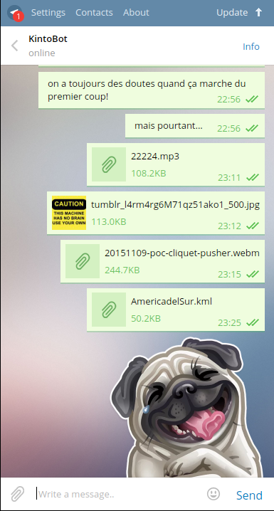
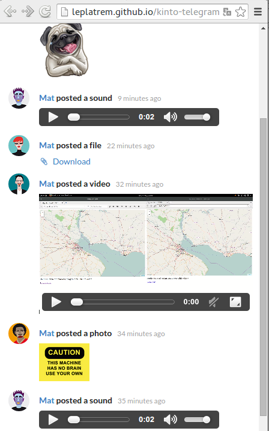
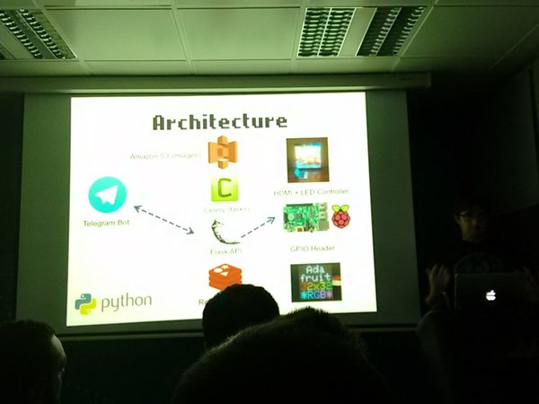
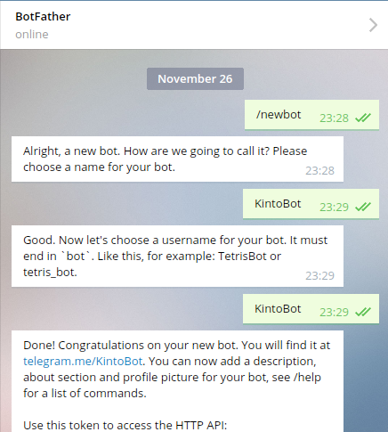

# Kinto Telegram Wall

**Live publication on a Web page from Telegram, using Kinto**

When you post a message, a photo, a video, a sticker or a sound it appears on a
Webpage, with live refresh! This is a lot of fun at parties!





## Demo

We run a demo, the bot is called ``@KintoBot``, search for it in Telegram.
The content are then shown publicly here: http://leplatrem.github.io/kinto-telegram-wall/.


## What is this ?

At Python Meetup Barcelona, [Xavier Orduña](https://twitter.com/xorduna) presented
its [Walled project](https://github.com/xorduna/walledproject): posting pictures
on a LED screen via a Telegram bot.



I found the presentation very inspiring, especially the fact that *chat bots* will
be some close companions in a near future; to assist us in a natural way or manage our
connected devices via some commands.

In Xavier's project, the Telegram bot transmits the messages and pictures
to a custom Flask API. Then a *Raspberry* pulls the data in order to refresh the
wall frame in the living room.

When you have to build such a project with bots, Raspberry and LED screens, having to implement a secure REST API that syncs data with fine-grained permissions is no much fun.

Using [Kinto](http://kinto.readthedocs.org/), this part requires no effort!

That's why I took his idea and rebuilt a similar prototype in a few hours: to demo
the value of *Kinto* in this context :) Hacking your project can now be **100% fun**!


## How does it work ?

1. A Telegram bot waits for messages, using [telepot](https://github.com/nickoala/telepot)
1. When a message comes in, the bot downloads the attached file (if any) from
   Telegram servers.
1. The bot posts a record to a Kinto server, with the text message or attachment
   in the HTTP request body
1. The Kinto server stores the record in *Redis* (*or PostgreSQL or whatever configured*)   and stores the file on disk (*or S3 if configured*), using the (*unstable*)
   [Kinto-attachment](https://github.com/Kinto/kinto-attachment/) plugin.
1. When someone visits the Webpage, a request to Kinto is performed to `fetch()`
   the records from Kinto and populate the wall.
1. When a new record is posted, Kinto sends a message to [Pusher](https://pusher.com/)
   which transmists it via a Websocket to refresh the Webpage without reload.

The whole source code is available in this repo. The bot is about a 100 Lines Of
Code and the Javascript around 80.


## How to run it yourself ?

### Kinto server

At Mozilla, we run a demo server of Kinto, and the scripts in this repository are using
it by default.

But **it is flushed everyday at 7:00 AM UTC**. In the case of a party, it can
sometimes become a desired feature :)

However, if you want to get your own *Kinto* running, you'll have to:

* Run a basic Kinto server using the instructions in the [Kinto documentation](http://kinto.readthedocs.org/)
* Follow the instructions to enable the [Kinto Attachment](https://github.com/Kinto/kinto-attachment/) plugin
* Follow the instructions to enable the [Pusher plugin](https://github.com/leplatrem/cliquet-pusher/tree/master/demo) for live refresh


### Run the bot

Go talk to `@BotFather` to create a new bot on Telegram server. You'll obtain a token:



Now, the bot — a Python program — will keep running in order to receive the messages and transmit
them to Kinto.

First, install the required python libraries:

```shell
$ sudo apt-get install python-dev python-virtualenv

$ virtualenv venv/
$ source venv/bin/activate
$ pip install telepot kinto-client
```

The bot needs to know the BotFather token, a user:password of your choice (any),
and a collection name that will be used by the Web page to filter messages of your party :)

The configuration is read from environment variables. You can use a shell script to set them:

```shell
# config.env
export TOKEN=the-token-the-botfather-gave
export SERVER_AUTH=botuser:some-secret-password-of-your-choice
export COLLECTION=myparty
```

If you run your own *Kinto* server, add:

```shell
export SERVER_URL=https://kinto.yourdomain.com/v1
```

And then run it:

```shell
$ source config.env
$ python run-bot.py

Listening...
```

> In this demo, the permissions are set to allow everyone to see the posts.
> Adjust the value in the bot source code to suit your usecase.


### Host the Webpage

* Adjust the configuration values for your setup in `script.js`
* Host `index.html`, `style.css` and `script.js` somewhere !


That's it!
